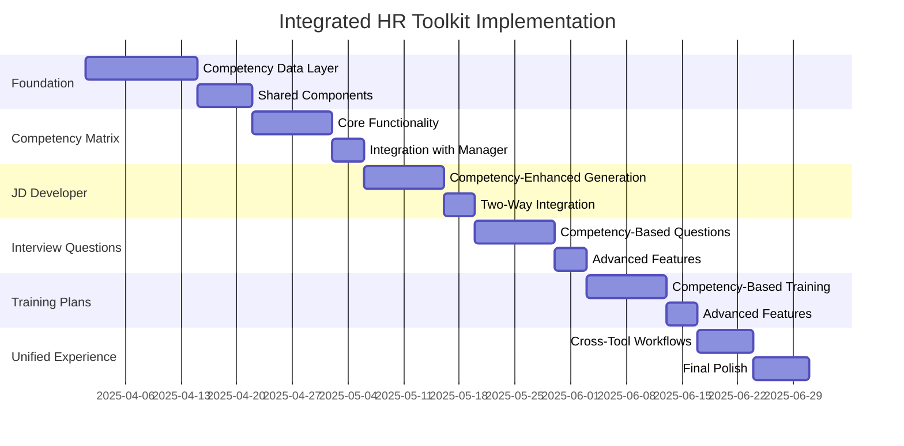

# Integrated HR Toolkit Implementation Plan

## Overview

This document outlines the implementation plan for integrating Synthalyst's HR tools into a unified ecosystem centered around competency frameworks. The integration will create a seamless workflow between the Competency Manager, Competency Matrix Creator, JD Developer, Interview Questions Generator, and Training Plan Creator.

## Goals

1. Create a unified data layer for competencies that can be accessed by all tools
2. Implement cross-tool workflows that maintain context and data continuity
3. Enhance each tool's functionality through competency framework integration
4. Develop a consistent user experience across all HR tools
5. Maximize the value of LLM outputs by providing rich competency context

## Implementation Phases

### Phase 1: Foundation (Weeks 1-2)

#### 1.1 Competency Data Layer

- Create a unified competency data model that supports:

  - Individual competency frameworks with multiple levels
  - Competency matrices mapping competencies to roles
  - Tagging and categorization for easy retrieval
  - Version history and audit trails

- Implement database schema updates:

  ```prisma
  model Competency {
    id            String   @id @default(cuid())
    name          String
    description   String
    industry      String
    category      String
    createdAt     DateTime @default(now())
    updatedAt     DateTime @updatedAt
    userId        String
    user          User     @relation(fields: [userId], references: [id])
    levels        CompetencyLevel[]
    jobDescriptions JobDescription[] // Relation to JDs using this competency
    interviewSets InterviewQuestionSet[] // Relation to interview question sets
    trainingPlans TrainingPlan[] // Relation to training plans
  }

  model CompetencyLevel {
    id            String   @id @default(cuid())
    level         String
    description   String
    behaviors     String[] // Array of expected behaviors
    requirements  String[] // Array of requirements
    competencyId  String
    competency    Competency @relation(fields: [competencyId], references: [id], onDelete: Cascade)
  }

  model CompetencyMatrix {
    id            String   @id @default(cuid())
    name          String
    description   String
    industry      String
    createdAt     DateTime @default(now())
    updatedAt     DateTime @updatedAt
    userId        String
    user          User     @relation(fields: [userId], references: [id])
    roles         MatrixRole[]
  }

  model MatrixRole {
    id                String   @id @default(cuid())
    title             String
    description       String
    matrixId          String
    matrix            CompetencyMatrix @relation(fields: [matrixId], references: [id], onDelete: Cascade)
    competencyLevels  RoleCompetencyLevel[]
  }

  model RoleCompetencyLevel {
    id            String   @id @default(cuid())
    roleId        String
    role          MatrixRole @relation(fields: [roleId], references: [id], onDelete: Cascade)
    competencyId  String
    competency    Competency @relation(fields: [competencyId], references: [id])
    levelRequired String    // References the level name in CompetencyLevel
  }
  ```

- Create API endpoints for competency data:
  - `GET /api/competencies` - List all competencies
  - `GET /api/competencies/:id` - Get a specific competency
  - `POST /api/competencies` - Create a new competency
  - `PUT /api/competencies/:id` - Update a competency
  - `GET /api/competency-matrices` - List all matrices
  - `GET /api/competency-matrices/:id` - Get a specific matrix
  - `POST /api/competency-matrices` - Create a new matrix

#### 1.2 Shared Components

- Create reusable UI components:

  - CompetencySelector - For selecting competencies from the user's library
  - CompetencyLevelSelector - For selecting specific levels of a competency
  - CompetencyDisplay - For consistently displaying competency information
  - CompetencyMatrixGrid - For displaying and editing competency matrices

- Implement shared utility functions:
  - `formatCompetencyForPrompt()` - Formats competency data for LLM prompts
  - `extractCompetencyData()` - Extracts competency information from LLM responses
  - `validateCompetencyStructure()` - Validates competency data structure

### Phase 2: Competency Matrix Creator (Weeks 3-4)

#### 2.1 Core Functionality

- Create the Competency Matrix Creator UI:

  - Matrix creation form with industry and role inputs
  - Role definition interface
  - Competency mapping grid
  - Matrix visualization component

- Implement the backend:
  - Create `/api/competency-matrix` endpoint
  - Develop LLM prompt for matrix generation
  - Implement matrix data processing and storage

#### 2.2 Integration with Competency Manager

- Add "Use in Matrix" option to saved competencies
- Implement competency import functionality in Matrix Creator
- Create bidirectional navigation between tools
- Ensure consistent data representation across both tools

### Phase 3: JD Developer Integration (Weeks 5-6)

#### 3.1 Competency-Enhanced JD Generation

- Update JD Developer UI:

  - Add CompetencySelector component
  - Implement competency level selection
  - Create "Generate from Competency Matrix" option

- Enhance JD Developer backend:
  - Update LLM prompt to incorporate competency data
  - Implement competency-to-JD mapping logic
  - Create storage for competency-JD relationships

#### 3.2 Two-Way Integration

- Implement "Extract Competencies" feature for existing JDs
- Create "Generate JD" option in Competency Manager
- Add "Complete Job Package" workflow that includes:
  - Job description
  - Required competencies
  - Suggested interview questions

### Phase 4: Interview Questions Generator Integration (Weeks 7-8)

#### 4.1 Competency-Based Question Generation

- Update Interview Questions Generator UI:

  - Add CompetencySelector component
  - Implement level-specific question generation
  - Create competency-based evaluation rubrics

- Enhance backend:
  - Update LLM prompt to generate questions targeting specific competency behaviors
  - Implement scoring rubric generation based on competency levels
  - Create storage for competency-question relationships

#### 4.2 Advanced Features

- Implement "Generate Complete Interview Kit" feature:

  - Questions organized by competency
  - Evaluation criteria for each competency
  - Scoring system based on competency levels
  - Candidate comparison matrix

- Create "Import from JD" functionality that:
  - Extracts competencies from selected JD
  - Generates questions for each competency
  - Creates a complete interview structure

### Phase 5: Training Plan Creator Integration (Weeks 9-10)

#### 5.1 Competency-Based Training Plans

- Update Training Plan Creator UI:

  - Add current/target competency level selection
  - Implement competency gap analysis visualization
  - Create role-based training plan generation

- Enhance backend:
  - Update LLM prompt to generate activities targeting specific competency gaps
  - Implement competency progression tracking
  - Create storage for competency-training relationships

#### 5.2 Advanced Features

- Implement "Career Development Path" feature:

  - Maps training plans to role progression in competency matrices
  - Creates multi-stage development plans
  - Tracks progress across competency levels

- Create "Team Development" functionality that:
  - Analyzes team competency distribution
  - Identifies team-wide competency gaps
  - Generates team training recommendations

### Phase 6: Unified Workflows & Polish (Weeks 11-12)

#### 6.1 Cross-Tool Workflows

- Implement "HR Toolkit Dashboard" with:

  - Overview of all competency frameworks and matrices
  - Quick access to all integrated tools
  - Recent activity and saved items

- Create end-to-end workflows:
  - "Complete Hiring Process" - JD → Interview Questions → Evaluation
  - "Employee Development" - Competency Assessment → Training Plan → Progress Tracking
  - "Role Design" - Competency Matrix → JD → Training Requirements

#### 6.2 Final Polish

- Implement consistent styling and UX across all tools
- Create comprehensive documentation
- Develop tutorial walkthroughs for integrated workflows
- Implement analytics to track tool usage and integration effectiveness

## Technical Requirements

### Frontend

- Shared state management for competency data
- Consistent component library for competency visualization
- Responsive design for all new components
- Progressive enhancement for complex features

### Backend

- Efficient database queries for competency relationships
- Caching strategy for frequently accessed competency data
- Optimized LLM prompts that leverage competency context
- Robust error handling for LLM generation failures

### LLM Integration

- Enhanced system prompts for each tool that incorporate competency data
- Consistent output formatting across all tools
- Fallback strategies for generation failures
- Quality validation for generated content

## Success Metrics

1. **User Engagement:**

   - Increase in cross-tool usage (users moving between integrated tools)
   - Higher completion rate for end-to-end workflows
   - Increased time spent in the application

2. **Output Quality:**

   - Higher user ratings for LLM-generated content
   - Reduced need for manual editing of generated content
   - Increased consistency between outputs from different tools

3. **Business Impact:**
   - Increased user retention
   - Higher conversion rate from free to premium
   - More positive testimonials specifically mentioning integrated workflows

## Implementation Timeline



## Next Steps

1. Review and approve this implementation plan
2. Set up the project in project management tool
3. Assign resources to Phase 1 tasks
4. Schedule weekly progress reviews
5. Begin implementation of the Competency Data Layer

## Appendix: LLM Prompt Enhancements

### Competency Matrix Creator Prompt

```
Create a competency matrix for the following:

Industry: {{industry}}
Roles to include: {{roles}}
Existing Competencies: {{competencies}}

For each role, determine the required level for each competency.
Consider industry standards and best practices.
Ensure clear progression paths between roles.
Provide justification for each competency level requirement.

Format the response as a structured matrix showing roles as rows and competencies as columns.
For each cell, indicate the required level and brief justification.
```

### JD Developer with Competency Integration

```
Create a job description for the following position:

Title: {{title}}
Industry: {{industry}}
Required Competencies:
{{#each competencies}}
- {{name}} at {{level}} level: {{levelDescription}}
{{/each}}

Additional Context: {{additionalContext}}

Incorporate the specific behaviors and requirements from each competency level into the job description.
Ensure the responsibilities and qualifications directly reflect the competency requirements.
Use industry-standard terminology consistent with the competency frameworks.
```

### Interview Questions with Competency Targeting

```
Generate interview questions to assess the following competencies:

{{#each competencies}}
Competency: {{name}}
Level to assess: {{level}}
Key behaviors:
{{#each behaviors}}
- {{this}}
{{/each}}
{{/each}}

For each competency:
1. Create behavioral questions that specifically target the key behaviors
2. Include situational questions relevant to the industry context
3. Provide an evaluation rubric with clear criteria based on the competency level
4. Include follow-up questions to probe deeper into the candidate's experience

Format the response as a structured interview guide organized by competency.
```

### Training Plan with Competency Gap Analysis

```
Create a training plan to develop the following competency:

Current Level: {{currentLevel}}
- {{currentLevelDescription}}
- Key behaviors: {{currentLevelBehaviors}}

Target Level: {{targetLevel}}
- {{targetLevelDescription}}
- Key behaviors: {{targetLevelBehaviors}}

Industry Context: {{industry}}

Identify the specific gaps between the current and target levels.
Create a progressive training plan with activities that directly address each gap.
Include measurable milestones that align with the competency behaviors.
Provide resources and learning opportunities specific to the industry context.
```
