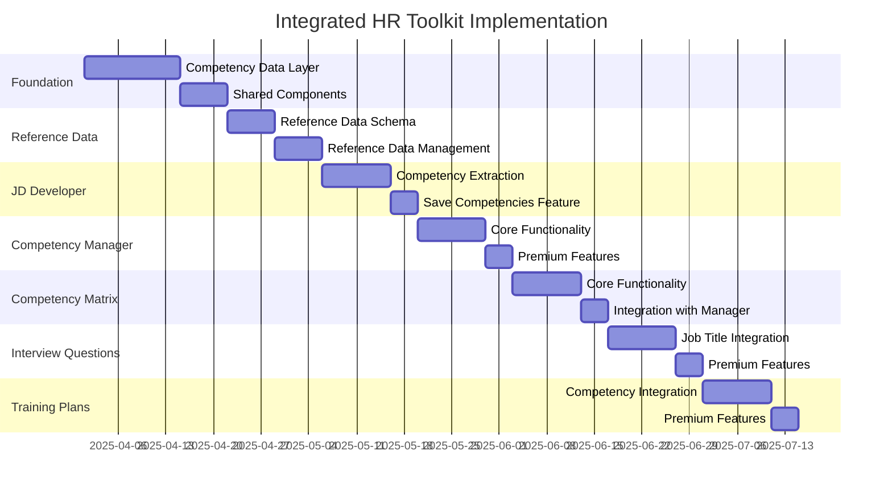

# Integrated HR Toolkit Implementation Plan

## Overview

This document outlines the implementation plan for integrating Synthalyst's HR tools into a unified ecosystem centered around competencies. The integration will create a seamless workflow between the Competency Manager, Competency Matrix Creator, JD Developer, Interview Questions Generator, and Training Plan Creator, while maintaining standalone functionality for freemium users.

## Goals

1. Create a unified data layer for competencies that can be accessed by all tools
2. Implement cross-tool workflows that maintain context and data continuity
3. Enhance each tool's functionality through competency framework integration
4. Develop a consistent user experience across all HR tools
5. Maximize the value of LLM outputs by providing rich competency context
6. Maintain full standalone functionality for freemium users
7. Provide enhanced integration features for premium users

## User Tiers and Features

### Freemium Users

- Access to standalone tools with full core functionality
- Each tool works independently with all required features
- No cross-tool data sharing or workflows
- Limited usage of LLM-powered features

### Premium Users

- Access to all standalone tools with unlimited usage
- Cross-tool integration and data sharing
- Enhanced LLM-powered features
- Ability to save and reuse competencies across tools
- Access to advanced features like competency matrices and integrated workflows

## Implementation Phases

### Phase 1: Foundation (Weeks 1-2)

#### 1.1 Competency Data Layer

- Create a unified competency data model that supports:

  - Individual competency frameworks with multiple levels
  - Competency matrices mapping competencies to roles
  - Tagging and categorization for easy retrieval
  - Version history and audit trails

- Implement database schema updates:

  ```prisma
  model Competency {
    id            String   @id @default(cuid())
    name          String
    description   String
    industry      String
    category      String
    createdAt     DateTime @default(now())
    updatedAt     DateTime @updatedAt
    userId        String
    user          User     @relation(fields: [userId], references: [id])
    levels        CompetencyLevel[]
    jobDescriptions JobDescription[] // Relation to JDs using this competency
    interviewSets InterviewQuestionSet[] // Relation to interview question sets
    trainingPlans TrainingPlan[] // Relation to training plans
    source        String?  // e.g., "JD_EXTRACTED", "USER_CREATED", "SYSTEM"
    sourceJdId    String?  // If extracted from a JD, the ID of that JD
  }

  model CompetencyLevel {
    id            String   @id @default(cuid())
    level         String
    description   String
    behaviors     String[] // Array of expected behaviors
    requirements  String[] // Array of requirements
    competencyId  String
    competency    Competency @relation(fields: [competencyId], references: [id], onDelete: Cascade)
  }

  model CompetencyMatrix {
    id            String   @id @default(cuid())
    name          String
    description   String
    industry      String
    createdAt     DateTime @default(now())
    updatedAt     DateTime @updatedAt
    userId        String
    user          User     @relation(fields: [userId], references: [id])
    roles         MatrixRole[]
  }

  model MatrixRole {
    id                String   @id @default(cuid())
    title             String
    description       String
    matrixId          String
    matrix            CompetencyMatrix @relation(fields: [matrixId], references: [id], onDelete: Cascade)
    competencyLevels  RoleCompetencyLevel[]
  }

  model RoleCompetencyLevel {
    id            String   @id @default(cuid())
    roleId        String
    role          MatrixRole @relation(fields: [roleId], references: [id], onDelete: Cascade)
    competencyId  String
    competency    Competency @relation(fields: [competencyId], references: [id])
    levelRequired String    // References the level name in CompetencyLevel
  }
  ```

- Create API endpoints for competency data:
  - `GET /api/competencies` - List all competencies
  - `GET /api/competencies/:id` - Get a specific competency
  - `POST /api/competencies` - Create a new competency
  - `PUT /api/competencies/:id` - Update a competency
  - `GET /api/competency-matrices` - List all matrices
  - `GET /api/competency-matrices/:id` - Get a specific matrix
  - `POST /api/competency-matrices` - Create a new matrix

#### 1.2 Shared Components

- Create reusable UI components:

  - CompetencySelector - For selecting competencies from the user's library
  - CompetencyLevelSelector - For selecting specific levels of a competency
  - CompetencyDisplay - For consistently displaying competency information
  - CompetencyMatrixGrid - For displaying and editing competency matrices

- Implement shared utility functions:
  - `formatCompetencyForPrompt()` - Formats competency data for LLM prompts
  - `extractCompetencyData()` - Extracts competency information from LLM responses
  - `validateCompetencyStructure()` - Validates competency data structure

### Phase 1.5: Organizational Reference Data (Weeks 2-3)

#### 1.5.1 Reference Data Schema

- Implement database schema for organizational reference data:

  ```prisma
  model CompetencyCategory {
    id            String   @id @default(cuid())
    name          String   @unique
    description   String
    createdAt     DateTime @default(now())
    updatedAt     DateTime @updatedAt
    competencies  Competency[]
  }

  model JobLevel {
    id            String   @id @default(cuid())
    name          String   // e.g., "Entry", "Associate", "Senior", "Lead", "Principal"
    code          String?  // e.g., "L1", "L2", "L3", etc.
    description   String
    order         Int      // For sorting levels in the correct order
    createdAt     DateTime @default(now())
    updatedAt     DateTime @updatedAt
    jobTitles     JobTitle[]
    matrixRoles   MatrixRole[]
  }

  model JobFamily {
    id            String   @id @default(cuid())
    name          String   // e.g., "Engineering", "Marketing", "Sales"
    description   String
    createdAt     DateTime @default(now())
    updatedAt     DateTime @updatedAt
    jobTitles     JobTitle[]
  }

  model JobTitle {
    id            String   @id @default(cuid())
    title         String
    description   String
    jobFamilyId   String
    jobFamily     JobFamily @relation(fields: [jobFamilyId], references: [id])
    jobLevelId    String
    jobLevel      JobLevel @relation(fields: [jobLevelId], references: [id])
    createdAt     DateTime @default(now())
    updatedAt     DateTime @updatedAt
    jobDescriptions JobDescription[]
  }

  model Department {
    id            String   @id @default(cuid())
    name          String
    description   String?
    createdAt     DateTime @default(now())
    updatedAt     DateTime @updatedAt
    jobTitles     JobTitle[]
  }

  model Industry {
    id            String   @id @default(cuid())
    name          String   @unique
    description   String?
    createdAt     DateTime @default(now())
    updatedAt     DateTime @updatedAt
    competencies  Competency[]
    competencyMatrices CompetencyMatrix[]
  }
  ```

- Update existing models to reference the new schema:

  ```prisma
  model Competency {
    // Existing fields...
    categoryId    String?
    category      CompetencyCategory? @relation(fields: [categoryId], references: [id])
    industryId    String?
    industry      Industry? @relation(fields: [industryId], references: [id])
  }

  model MatrixRole {
    // Existing fields...
    jobTitleId    String?
    jobTitle      JobTitle? @relation(fields: [jobTitleId], references: [id])
    jobLevelId    String?
    jobLevel      JobLevel? @relation(fields: [jobLevelId], references: [id])
  }
  ```

#### 1.5.2 Reference Data Management

- Create admin interfaces for managing reference data:

  - CompetencyCategoryManager - For creating and editing competency categories
  - JobLevelManager - For defining job levels and progression criteria
  - JobFamilyManager - For creating and organizing job families
  - JobTitleManager - For standardizing job titles across the organization
  - IndustryManager - For managing industry-specific data

- Implement API endpoints for reference data:
  - `GET /api/reference/competency-categories` - List all competency categories
  - `GET /api/reference/job-levels` - List all job levels
  - `GET /api/reference/job-families` - List all job families
  - `GET /api/reference/job-titles` - List all job titles
  - `GET /api/reference/industries` - List all industries
  - Corresponding POST, PUT, and DELETE endpoints for each resource

#### 1.5.3 Seed Data and Templates

- Create seed data for common reference data:

  - Standard competency categories (Technical, Leadership, Communication, etc.)
  - Common job levels (Entry, Associate, Senior, Lead, Principal)
  - Industry-standard job families (Engineering, Marketing, Sales, etc.)
  - Sample job titles for each family and level

- Implement industry-specific templates:

  - Technology industry competency sets
  - Healthcare industry competency sets
  - Finance industry competency sets
  - Manufacturing industry competency sets
  - Retail industry competency sets

- Create import/export functionality:
  - Allow users to import reference data from CSV/Excel
  - Enable export of reference data for backup or sharing
  - Provide template files for data import

#### 1.5.4 Reference Data Integration

- Enhance UI components to use reference data:

  - Update CompetencySelector to filter by category and industry
  - Enhance job title selection in forms with structured job level and family data
  - Add tooltips and guidance based on reference data

- Update LLM prompts to leverage reference data:
  - Include industry-specific terminology in prompts
  - Reference standard job level expectations
  - Use consistent naming conventions from reference data

### Phase 2: Enhanced JD Developer (Weeks 3-4)

#### 2.1 Competency Extraction and Standardization

- Implement competency extraction from JDs:

  - Create LLM service to extract competencies from JD content
  - Develop standardization logic to ensure consistency
  - Implement deduplication to prevent similar competencies

- Add "Save Competencies" feature for premium users:
  - Create UI for reviewing extracted competencies
  - Implement saving functionality with user confirmation
  - Add competency visualization in JD output

#### 2.2 Backend Services

- Create competency extraction service:

  ```typescript
  // Example service function
  async function extractAndStandardizeCompetencies(
    jdContent,
    jobTitle,
    jobLevel,
    industry
  ) {
    // Extract competencies using LLM
    const extractionPrompt = `
      Extract key competencies from this job description for a ${jobTitle} at ${jobLevel} level in the ${industry} industry.
      For each competency:
      1. Provide a clear name
      2. Write a concise description
      3. List 3-5 observable behaviors for this level
      
      Job Description:
      ${jdContent}
      
      Format as JSON.
    `;

    const extractedCompetencies = await llmService.generateJSON(
      extractionPrompt
    );

    // Standardize competencies
    const standardizedCompetencies = await standardizeCompetencies(
      extractedCompetencies,
      userId
    );

    return standardizedCompetencies;
  }

  // Standardization function
  async function standardizeCompetencies(competencies, userId) {
    // Get existing competencies for this user
    const existingCompetencies = await prisma.competency.findMany({
      where: { userId },
    });

    // Use LLM to detect duplicates and standardize
    const standardizationPrompt = `
      Standardize these competencies and identify any duplicates or similar competencies.
      For each competency, either:
      1. Match it to an existing competency if similar
      2. Standardize the name and description if it's new
      
      New competencies:
      ${JSON.stringify(competencies)}
      
      Existing competencies:
      ${JSON.stringify(existingCompetencies)}
      
      Return standardized results as JSON.
    `;

    return await llmService.generateJSON(standardizationPrompt);
  }
  ```

### Phase 3: Competency Manager (Weeks 5-6)

#### 3.1 Core Functionality

- Create the Competency Manager UI:

  - Competency creation form with LLM assistance
  - Competency library with filtering and search
  - Competency level editor
  - Competency visualization components

- Implement the backend:
  - Create `/api/competencies` endpoints
  - Develop LLM prompt for competency creation
  - Implement competency data processing and storage

#### 3.2 Premium Features

- Add "Create Competency" feature for premium users:
  - LLM-assisted competency creation from minimal inputs
  - Automatic level specification generation
  - Integration with organizational reference data

### Phase 4: Competency Matrix Creator (Weeks 7-8)

#### 4.1 Core Functionality (Premium Only)

- Create the Competency Matrix Creator UI:

  - Matrix creation form with industry and role inputs
  - Role definition interface
  - Competency mapping grid
  - Matrix visualization component

- Implement the backend:
  - Create `/api/competency-matrix` endpoint
  - Develop LLM prompt for matrix generation
  - Implement matrix data processing and storage

#### 4.2 Integration with Competency Manager

- Add "Use in Matrix" option to saved competencies
- Implement competency import functionality in Matrix Creator
- Create bidirectional navigation between tools
- Ensure consistent data representation across both tools

### Phase 5: Enhanced Interview Questions Generator (Weeks 9-10)

#### 5.1 Job Title Integration for Premium Users

- Update Interview Questions Generator UI:

  - Add job title and level selection for premium users
  - Implement automatic competency population based on job selection
  - Maintain existing functionality for freemium users

- Enhance backend:
  - Create job title lookup service
  - Implement competency retrieval based on job title
  - Update LLM prompt to incorporate competency data

#### 5.2 Implementation Details

```typescript
// Example of premium job title integration
async function getCompetenciesForJobTitle(jobTitleId, jobLevelId) {
  // Get job details
  const jobTitle = await prisma.jobTitle.findUnique({
    where: { id: jobTitleId },
    include: {
      jobLevel: true,
      jobFamily: true,
    },
  });

  // Find JDs with this job title
  const jds = await prisma.jobDescription.findMany({
    where: {
      jobTitleId,
      jobLevelId,
    },
    include: {
      competencies: true,
    },
  });

  // Collect competencies from JDs
  const competencyIds = new Set();
  jds.forEach((jd) => {
    jd.competencies.forEach((comp) => {
      competencyIds.add(comp.id);
    });
  });

  // Get full competency details
  const competencies = await prisma.competency.findMany({
    where: {
      id: { in: Array.from(competencyIds) },
    },
    include: {
      levels: true,
    },
  });

  return competencies;
}
```

### Phase 6: Training Plan Creator Integration (Weeks 11-12)

#### 6.1 Competency-Based Training Plans (Premium)

- Update Training Plan Creator UI:

  - Add current/target competency level selection for premium users
  - Implement competency gap analysis visualization
  - Create role-based training plan generation

- Enhance backend:
  - Update LLM prompt to generate activities targeting specific competency gaps
  - Implement competency progression tracking
  - Create storage for competency-training relationships

## Technical Requirements

### Frontend

- Shared state management for competency data
- Consistent component library for competency visualization
- Responsive design for all new components
- Progressive enhancement for complex features
- Clear distinction between premium and freemium features

### Backend

- Efficient database queries for competency relationships
- Caching strategy for frequently accessed competency data
- Optimized LLM prompts that leverage competency context
- Robust error handling for LLM generation failures
- User tier validation for premium features

### LLM Integration

- Enhanced system prompts for each tool that incorporate competency data
- Consistent output formatting across all tools
- Fallback strategies for generation failures
- Quality validation for generated content
- Competency standardization and deduplication logic

## Success Metrics

1. **User Engagement:**

   - Increase in cross-tool usage for premium users
   - Higher completion rate for end-to-end workflows
   - Increased time spent in the application
   - Conversion rate from freemium to premium

2. **Output Quality:**

   - Higher user ratings for LLM-generated content
   - Reduced need for manual editing of generated content
   - Increased consistency between outputs from different tools

3. **Business Impact:**
   - Increased user retention
   - Higher conversion rate from free to premium
   - More positive testimonials specifically mentioning integrated workflows

## Implementation Timeline



## Next Steps

1. Review and approve this implementation plan
2. Set up the project in project management tool
3. Assign resources to Phase 1 tasks
4. Schedule weekly progress reviews
5. Begin implementation of the Competency Data Layer

## Backward Compatibility Strategy

To ensure that the implementation of the integrated HR toolkit does not break existing functionality, we will follow these principles:

### Database Schema Evolution

- **Additive Schema Changes**: All schema changes will be additive (new tables, optional columns)
- **Nullable Foreign Keys**: New relationships will use nullable foreign keys
- **Migration Strategy**:
  ```prisma
  // Example of backward-compatible schema change
  model JobDescription {
    id            String   @id @default(cuid())
    // Existing fields remain unchanged
    // ...

    // New fields are nullable
    jobTitleId    String?
    jobTitle      JobTitle? @relation(fields: [jobTitleId], references: [id])
    competencies  Competency[] // Many-to-many relation
  }
  ```

### API Versioning

- **Maintain Existing Endpoints**: Current API endpoints will remain unchanged
- **Version New Endpoints**: New integrated functionality will use versioned endpoints
  ```
  /api/v1/job-descriptions  // Existing endpoint
  /api/v2/job-descriptions  // Enhanced endpoint with competency integration
  ```
- **Graceful Degradation**: New endpoints will fall back to basic functionality if premium features are unavailable

### UI/UX Considerations

- **Progressive Enhancement**: New features will be introduced as optional enhancements
- **Non-Disruptive UI Changes**: Premium features will be presented as "upgrade opportunities" without disrupting the core experience
- **Consistent Design Language**: New components will follow existing design patterns

### Testing Strategy

- **Comprehensive Regression Testing**: Automated tests for all existing functionality
- **Feature-Flag Testing**: Test both with and without new features enabled
- **User Journey Preservation**: Ensure all existing user journeys remain functional
- **Cross-Browser Compatibility**: Test across all supported browsers and devices

### Rollout Plan

- **Phased Deployment**: Release changes in small, manageable increments
- **Feature Toggles**: Use feature flags to enable/disable new functionality
- **Monitoring**: Implement enhanced error tracking and usage analytics
- **Rollback Plan**: Maintain ability to quickly disable new features if issues arise

### Code Organization

- **Module Isolation**: New functionality will be isolated in separate modules
- **Interface Contracts**: Clear interfaces between existing and new code
- **Dependency Injection**: Use dependency injection to swap implementations
  ```typescript
  // Example of dependency injection for backward compatibility
  function getCompetencyService(user) {
    if (user?.isPremium && FEATURES.COMPETENCY_EXTRACTION) {
      return new EnhancedCompetencyService();
    }
    return new BasicCompetencyService();
  }
  ```

## Appendix: LLM Prompt Enhancements

### Competency Extraction from JD

```
Extract the key competencies from this job description for a {{jobTitle}} at {{jobLevel}} level in the {{industry}} industry.

For each competency:
1. Provide a clear name
2. Write a concise description
3. List 3-5 observable behaviors for this level

Job Description:
{{jdContent}}

Format as JSON:
[
  {
    "name": "Competency name",
    "description": "Competency description",
    "level": "{{jobLevel}}",
    "behaviors": ["Behavior 1", "Behavior 2", "Behavior 3"]
  }
]
```

### Competency Standardization

```
Standardize these competencies and identify any duplicates or similar competencies.
For each competency, either:
1. Match it to an existing competency if similar
2. Standardize the name and description if it's new

New competencies:
{{newCompetencies}}

Existing competencies:
{{existingCompetencies}}

Return standardized results as JSON.
```

### Premium Interview Questions Generator

```
Generate interview questions for a {{jobTitle}} at {{jobLevel}} level based on these competencies:

{{#each competencies}}
Competency: {{name}}
Description: {{description}}
Key behaviors:
{{#each behaviors}}
- {{this}}
{{/each}}
{{/each}}

For each competency:
1. Create behavioral questions that specifically target the key behaviors
2. Include situational questions relevant to the industry context
3. Provide an evaluation rubric with clear criteria based on the competency level
4. Include follow-up questions to probe deeper into the candidate's experience

Format the response as a structured interview guide.
```
