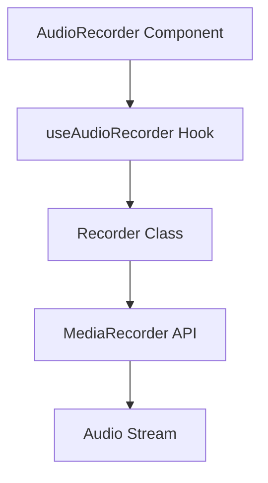
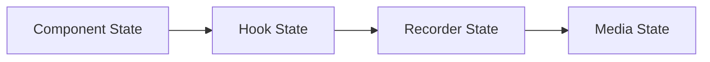
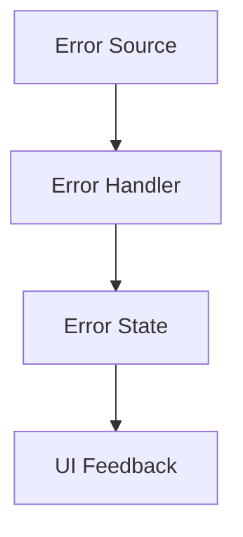
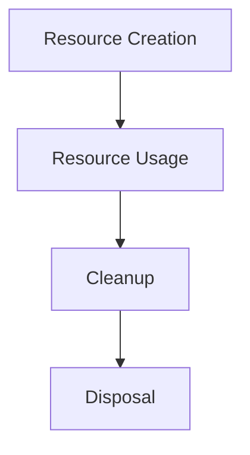
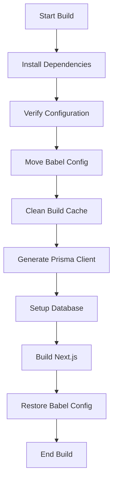
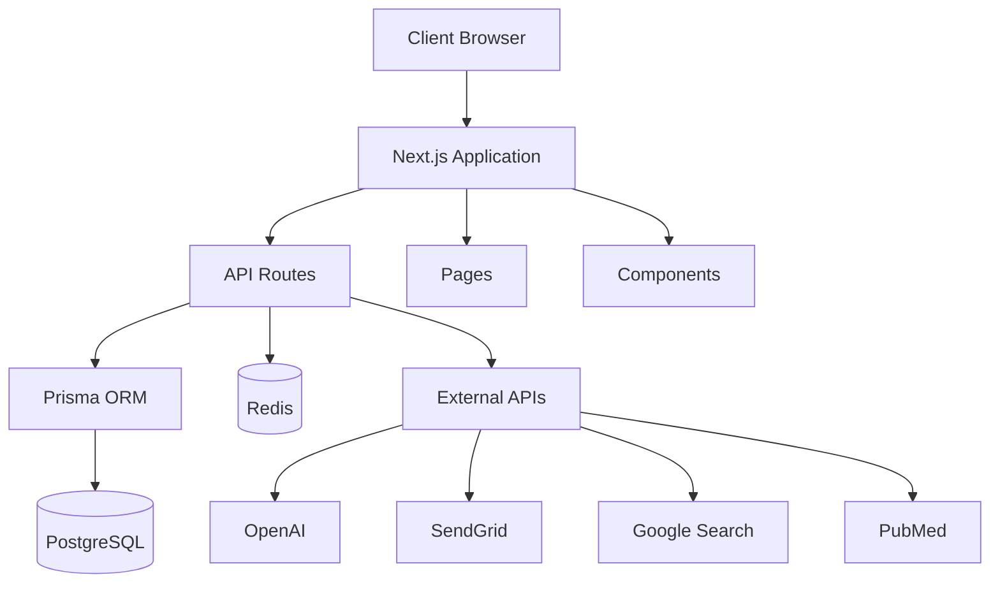
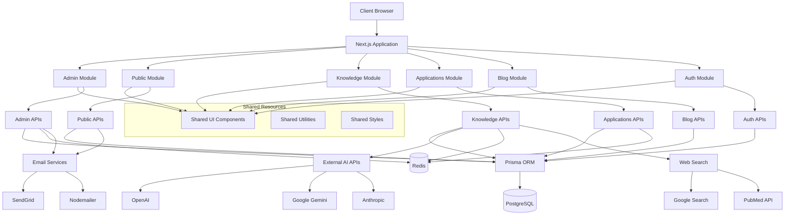

# System Patterns

_Last Updated: March 18, 2025_

## UI Component Resolution System (2025-03-18)

### Architecture

The UI Component Resolution System attempts to ensure reliable component availability during deployment:

1. **Verification Layer**: Scripts verify the existence of critical UI components
2. **Copy Layer**: Scripts copy essential components to the build directory
3. **Alias Layer**: Webpack configuration provides explicit path aliases
4. **Fallback Layer**: Default implementations ensure minimal functionality if components fail to load
5. **Dependency Layer**: Dependency verification and installation during build process

### Data Flow

```
Build Process Start
  ↓
Dependency Verification and Installation
  ↓
Component Verification (verify-ui-components.js)
  ↓
Component Copying (copy-ui-components-to-build.js)
  ↓
Webpack Alias Configuration (next.config.js)
  ↓
Next.js Build Process
  ↓
Deployment Bundle
```

### Key Patterns

1. **Dependency Management**: Explicit verification and installation of required dependencies
2. **Build-time Component Verification**: Checks for the existence of required components before build
3. **Dynamic Component Copying**: Copies essential components to the build directory during build
4. **Explicit Path Aliasing**: Uses webpack configuration to map component imports to specific paths
5. **Fallback Component Strategy**: Provides default implementations to prevent critical failures

### Implementation Details

1. The system primarily targets components imported via the `@/components/ui/` path alias
2. Essential components include breadcrumb, button, card, and tabs components
3. The vercel-build.sh script orchestrates the dependency installation, component verification, and copying process
4. The webpack configuration in next.config.js provides explicit path resolution
5. Despite multiple layers of fallbacks, the system still encounters issues in production deployment

### Known Limitations

1. Despite extensive configuration, Vercel builds still fail with "Module not found" errors
2. Local development works perfectly, but production builds encounter path resolution issues
3. The multiple layers of fallbacks add complexity to the build process
4. Future versions may need to consider more radical approaches:
   - Bundle all UI components into a single file
   - Use relative imports instead of path aliases
   - Directly integrate component code where it's used

## Audio Recording System (2023-07-10)

### Architecture

The audio recording system follows a layered architecture:

1. **UI Layer**: `AudioRecorder` component in React
2. **Hook Layer**: `useAudioRecorder` custom hook for state management
3. **Service Layer**: `recorder.ts` for MediaRecorder API interactions
4. **API Layer**: Server-side routes for file storage and retrieval

### Data Flow

```
UI (AudioRecorder Component)
  ↓ ↑
Hook (useAudioRecorder)
  ↓ ↑
Service (recorder.ts)
  ↓ ↑
Browser MediaRecorder API
  ↓
API Routes
  ↓
Server File Storage
```

### Key Patterns

1. **Custom Hook Pattern**: Separates state management from UI rendering
2. **Service Layer Pattern**: Isolates browser API interactions
3. **API Route Pattern**: Provides RESTful endpoints for file operations
4. **Error Boundary Pattern**: Handles and displays errors gracefully

### Testing Strategy

1. **Component Tests**: Verify UI rendering and user interactions
2. **Hook Tests**: Ensure state management works correctly
3. **API Tests**: Validate server-side functionality
4. **Mock Pattern**: Simulate browser APIs and file operations

### Component Architecture



### State Management Pattern



### Error Handling Pattern



### Resource Management Pattern



## Design Patterns

### Component Patterns

1. Controlled Components:

   - Props-driven behavior
   - Clear state management
   - Predictable updates

2. Custom Hooks:

   - Reusable logic
   - Encapsulated state
   - Clean interfaces

3. Error Boundaries:
   - Graceful error handling
   - User feedback
   - Recovery options

### State Management Patterns

1. State Initialization:

   ```typescript
   const [state, setState] = useState(() => ({
     initialValue: computeInitialValue(),
   }));
   ```

2. Effect Cleanup:

   ```typescript
   useEffect(() => {
     // Setup
     return () => {
       // Cleanup
     };
   }, [dependencies]);
   ```

3. Ref Management:
   ```typescript
   const ref = useRef(null);
   useEffect(() => {
     if (ref.current) {
       // Safe access
     }
   }, []);
   ```

### Mobile-First Patterns

1. Responsive Design:

   - Fluid layouts
   - Breakpoint management
   - Touch-friendly controls

2. Performance:

   - Resource optimization
   - Efficient updates
   - Memory management

3. Accessibility:
   - ARIA attributes
   - Keyboard navigation
   - Screen reader support

## Implementation Guidelines

### Code Organization

1. Component Structure:

   ```
   /components
     /interview-prep
       AudioRecorder.tsx
   /hooks
     useAudioRecorder.ts
   /lib
     /audio
       recorder.ts
   ```

2. Type Definitions:

   ```typescript
   interface Props {
     // Component props
   }

   interface State {
     // State interface
   }

   type Handler = (event: Event) => void;
   ```

3. Error Management:
   ```typescript
   try {
     // Operation
   } catch (error) {
     // Type-safe error handling
   }
   ```

### Testing Strategy

1. Unit Tests:

   - Component rendering
   - Hook behavior
   - Error cases

2. Integration Tests:

   - Browser compatibility
   - Device testing
   - Performance metrics

3. User Testing:
   - Mobile usability
   - Error recovery
   - Feature completeness

## System Architecture

The application follows a modern Next.js architecture with the following key components:

- **Frontend**: Next.js App Router with React components
- **Backend**: Next.js API routes
- **Database**: PostgreSQL with Prisma ORM
- **Authentication**: NextAuth.js
- **Styling**: Tailwind CSS with shadcn/ui components

## Interview Prep Feature Architecture

The Interview Prep feature follows a modular architecture with clear separation of concerns:

### User Flow

The Interview Prep feature is designed with a logical user flow:

1. **Interview Prep Plan** (First Activity):

   - Users input job details or import from ApplyRight
   - System generates a personalized preparation plan
   - Users can export the plan as PDF

2. **Mock Interview**:

   - Users practice with AI-generated questions
   - System provides feedback on responses
   - Summary page shows overall performance

3. **Question Library**:
   - Users browse and filter questions
   - Save questions for later review
   - Add notes to saved questions

This flow guides users through the preparation process, emphasizing planning before practice.

### Premium Feature Testing

For testing purposes, all authenticated users are treated as premium users. This allows for comprehensive testing of premium features before implementing actual subscription checks. The `checkPremiumStatus` function in the Interview Prep Plan component is configured to return `true` for any authenticated user.

### Data Models

1. **InterviewSession**:

   - Represents a mock interview session
   - Contains metadata about the job, company, and industry
   - Tracks session status and timing
   - Links to questions and responses

2. **InterviewQuestion**:

   - Represents a question in a mock interview
   - Contains question text, type, and order
   - Links to the session and response

3. **InterviewResponse**:

   - Represents a user's response to a question
   - Contains response text, feedback, and scoring
   - Links to the question and session

4. **QuestionLibrary**:

   - Represents a question in the library
   - Contains question text, job type, industry, difficulty, and category
   - Can be saved by users

5. **UserSavedQuestion**:
   - Represents a question saved by a user
   - Contains user notes
   - Links to the user and question

### API Structure

1. **Mock Interview API**:

   - `/api/interview-prep/mock-interview` (POST, PUT):
     - POST: Start a new session
     - PUT: Submit a response
   - `/api/interview-prep/mock-interview/[sessionId]` (GET, DELETE):
     - GET: Retrieve session details
     - DELETE: End a session and generate summary
   - `/api/interview-prep/mock-interview/evaluate` (POST):
     - Evaluate a response with detailed feedback

2. **Question Library API**:

   - `/api/interview-prep/questions` (GET, POST):
     - GET: Browse questions with filters
     - POST: Save a question to personal library
   - `/api/interview-prep/questions/[id]` (GET, PUT, DELETE):
     - GET: Retrieve a saved question
     - PUT: Update notes for a saved question
     - DELETE: Remove a question from personal library

3. **Interview Prep Plan API**:
   - `/api/interview-prep/generate-plan` (POST):
     - Generate a personalized interview preparation plan
     - Create practice questions based on job details

### Component Structure

1. **Page Components**:

   - `InterviewPrepPage`: Main landing page with feature overview
   - `InterviewPrepPlan`: Plan generation page
   - `MockInterviewPage`: Mock interview session page
   - `InterviewSummaryPage`: Session summary page
   - `QuestionsPage`: Question library browsing page
   - `QuestionDetailPage`: Individual question page

2. **Shared Components**:

   - `JobDetailsForm`: Form for collecting job details
   - `InterviewPrepPDF`: PDF rendering component
   - `PDFRenderer`: PDF download component
   - `FeedbackLayout`: Layout with feedback button

3. **Utility Components**:
   - `crypto-polyfill.js`: Polyfills for PDF generation
   - `pdf-utils.js`: Utilities for PDF generation and download

## Key Design Patterns

### State Management

- **Client-side State**: React useState and useEffect hooks for component-level state
- **Server State**: API routes with Prisma for database interactions
- **Persistence**: localStorage for session persistence between page refreshes

### Component Patterns

- **Layout Components**: FeedbackLayout for consistent page structure
- **Card-based UI**: Card components for displaying questions, feedback, and statistics
- **Responsive Design**: Mobile-first approach with responsive grid layouts

### API Patterns

- **RESTful API**: Standard HTTP methods (GET, POST, PUT, DELETE) for resource operations
- **Request Validation**: Zod schema validation for API request bodies
- **Error Handling**: Consistent error response format with appropriate status codes
- **Authentication Check**: Server-side session validation for protected routes

## Other Key Technical Patterns

- **Form Handling**: Controlled components with React state
- **Loading States**: Visual indicators for asynchronous operations
- **Error Handling**: Try-catch blocks with toast notifications for user feedback
- **Pagination**: Offset-based pagination for large data sets
- **Filtering**: Query parameter-based filtering for data retrieval

## System Architecture

### Next.js App Router Architecture

The application is built using Next.js with the App Router architecture, which provides several advantages:

- Server Components for improved performance and SEO
- Built-in API routes for backend functionality
- File-based routing for simplified navigation
- Metadata API for dynamic SEO optimization
- Server-side rendering capabilities for improved initial load times

### Module System

- **CommonJS Modules**: The application uses CommonJS module format (require/module.exports) for compatibility
- **Configuration Files**: All configuration files (tailwind.config.ts, postcss.config.ts) use module.exports syntax
- **Script Files**: Utility scripts use .cjs extension to ensure they are treated as CommonJS modules
- **Module Resolution**: Next.js is configured to handle CommonJS modules correctly

### Component Structure

- **Layout Components**: Define the overall structure of pages (header, footer, etc.)
- **Page Components**: Implement specific page functionality
- **UI Components**: Reusable interface elements
- **Feature Components**: Implement specific features like ApplyRight, Interview Prep, etc.

### Data Flow

- Server Components fetch data on the server
- Client Components handle user interactions
- API routes provide backend functionality
- Database interactions are handled through Prisma

### Feedback System Architecture

- **Dual Storage Strategy**:
  - Primary: Prisma database with AppFeedback model
  - Fallback: File-based JSON storage in feedback-data.json
- **Component Structure**:
  - FeedbackLayout: Wrapper component for pages with feedback functionality
  - FeedbackButton: Trigger for feedback modal
  - FeedbackForm: Form for collecting ratings and comments
- **API Routes**:
  - /api/feedback: For submitting feedback
  - /api/admin/feedback: For retrieving feedback (admin only)
  - /api/admin/feedback/export: For exporting feedback to CSV (admin only)
- **Error Handling**:
  - Graceful degradation from database to file storage
  - Comprehensive logging for troubleshooting
  - User-friendly error messages

## Key Technical Decisions

### SEO Implementation

- **Metadata API**: Using Next.js Metadata API for dynamic metadata generation
- **JSON-LD**: Implementing structured data using JSON-LD format
- **Dynamic Sitemap**: Generating sitemap.xml dynamically based on content
- **Dynamic Robots.txt**: Configuring robots.txt dynamically

### CSS Strategy

- **Critical CSS**: Inline critical CSS for above-the-fold content
- **Non-Critical CSS**: Load non-critical CSS asynchronously
- **Tailwind CSS**: Utility-first CSS framework for consistent styling
- **CSS Variables**: Used for theming and consistent design

### JavaScript Optimization

- **Code Splitting**: Automatic code splitting by Next.js
- **Dynamic Imports**: Lazy loading components when needed
- **Script Optimization**: Using next/script for script loading strategies
- **Tree Shaking**: Removing unused code

### Image Optimization

- **next/image**: Using Next.js Image component for automatic optimization
- **Responsive Images**: Implementing srcset for different screen sizes
- **Lazy Loading**: Loading images only when they enter the viewport
- **WebP Format**: Using modern image formats when supported

## Design Patterns in Use

### Component Patterns

- **Compound Components**: For complex UI elements with multiple parts
- **Render Props**: For sharing code between components
- **Higher-Order Components**: For adding functionality to existing components
- **Custom Hooks**: For reusing stateful logic

### State Management

- **React Context**: For global state management
- **useState/useReducer**: For component-level state
- **Server State**: For data fetched from the server

### API Patterns

- **RESTful API**: For standard CRUD operations
- **API Routes**: Using Next.js API routes for backend functionality
- **Error Handling**: Consistent error handling across API calls

### Accessibility Patterns

- **Semantic HTML**: Using appropriate HTML elements
- **ARIA Attributes**: Adding ARIA attributes when needed
- **Keyboard Navigation**: Ensuring keyboard accessibility
- **Focus Management**: Proper focus handling for modals and dialogs

## Component Relationships

### Layout Structure

```
RootLayout
├── Header
│   ├── Navigation
│   └── AuthButtons
├── Main Content
│   └── Page-specific components
└── Footer
    ├── FooterLinks
    └── SocialLinks
```

### Feature Relationships

```
ApplyRight
├── FileUpload
├── JobDescription
├── ResumePreview
└── CoverLetterPreview

InterviewPrep
├── JobDetailsForm
├── InterviewPlan
├── PracticeQuestions
└── MockInterview (Premium)

Blog
├── BlogList
├── BlogPost
├── CategoryFilter
└── SearchBar
```

## Technical Constraints

- Next.js App Router architecture
- TypeScript for type safety
- Tailwind CSS for styling
- Prisma for database interactions
- NextAuth for authentication
- Vercel for deployment

### CSS Conflict Resolution

- **Custom Prefixed Classes**: Using `synthalyst-` prefix for custom classes to avoid conflicts
- **CSS Specificity Management**: Using higher specificity selectors when needed
- **Important Flag Usage**: Strategic use of `!important` for critical styling
- **Media Queries**: Implementing responsive behavior with breakpoint-specific styles
- **Development vs. Production**: Strategies for handling CSS differences between environments
  - Identifying conflicting styles in production
  - Creating override classes with higher specificity
  - Testing in both environments to ensure consistency

## Audio Recording Architecture

### Storage Abstraction Pattern

We've implemented a flexible storage abstraction for audio recordings that follows the Strategy pattern:

```typescript
// Interface defining the storage operations
export interface AudioStorage {
  saveAudio(
    audioBlob: Blob,
    filename?: string
  ): Promise<{ url: string; filename: string }>;
  getAudioUrl(filename: string): Promise<string>;
}

// Concrete implementation for local filesystem storage
class LocalAudioStorage implements AudioStorage {
  // Implementation details...
}

// Concrete implementation for AWS S3 storage
class S3AudioStorage implements AudioStorage {
  // Implementation details...
}

// Factory function to create the appropriate storage implementation
export function createAudioStorage(): AudioStorage {
  const storageType = process.env.AUDIO_STORAGE_TYPE || "local";

  switch (storageType) {
    case "s3":
      return new S3AudioStorage();
    case "local":
    default:
      return new LocalAudioStorage();
  }
}

// Export a singleton instance
export const audioStorage = createAudioStorage();
```

This pattern allows us to:

1. Switch between storage implementations without changing client code
2. Add new storage providers easily by implementing the AudioStorage interface
3. Test different storage implementations independently
4. Configure the storage type via environment variables

### API Route Design

The audio API routes follow RESTful principles:

1. **POST /api/audio** - Upload a new audio recording

   - Accepts multipart/form-data with an "audio" field
   - Validates file size and MIME type
   - Stores the file using the configured storage provider
   - Creates a database record for tracking
   - Returns the URL, filename, and ID of the recording

2. **GET /api/audio** - Retrieve an audio recording
   - Accepts either a filename or recording ID as query parameters
   - Looks up the recording in the database if ID is provided
   - Generates a URL for accessing the audio file
   - Returns the URL to the client

### Database Integration

Audio recordings are tracked in the database using the AudioRecording model:

```prisma
model AudioRecording {
  id        String   @id @default(uuid())
  filename  String
  url       String
  userId    String?
  createdAt DateTime @default(now())
  updatedAt DateTime @updatedAt

  @@index([userId])
}
```

This allows us to:

1. Associate recordings with users
2. Track metadata about recordings
3. Implement access control based on ownership
4. Query and filter recordings

### Client-Side Component Design

The AudioRecorder component follows a stateful component pattern:

1. Manages internal state for recording status, playback, and errors
2. Provides a clean API for parent components
3. Handles browser compatibility issues internally
4. Provides clear visual feedback to users

## Caching Architecture [2024-03-15]

### Cache Key Strategy

- Version-based prefixing for breaking changes
- Job details incorporated in key generation
- Base64 encoded optional parameters
- Premium user flag in key structure

### Cache Duration

- Success responses: 24 hours TTL
- Fallback content: 12 hours TTL
- Premium users: Optional cache bypass

### Cache Warming

- Pre-cached responses for common job titles
- Background execution for minimal latency
- Error handling with fallback content
- Monitoring of warm cache hits

### Cache Invalidation

- Automatic on error responses
- Version-based for breaking changes
- Premium user manual bypass
- TTL-based expiration

### Cache Response Structure

- Cache status metadata
- Generation timestamps
- Fallback content markers
- Source tracking (cache vs. generated)

### Performance Monitoring

- Cache hit/miss tracking
- Response time logging
- Error rate monitoring
- Cache size tracking

### Error Handling

- Fallback content generation
- Automatic retry mechanism
- Error logging and monitoring
- User feedback on cache status

## Tailwind CSS Configuration Patterns (March 17, 2025)

### PostCSS Integration

The application uses Tailwind CSS with PostCSS for styling. The configuration follows these patterns:

1. **PostCSS Plugin Structure**:

   ```javascript
   /** @type {import('postcss-load-config').Config} */
   const config = {
     plugins: {
       "@tailwindcss/postcss": {},
       autoprefixer: {},
     },
   };

   module.exports = config;
   ```

2. **CSS Import Pattern**:

   ```css
   /* In CSS files that use Tailwind */
   @tailwind base;
   @tailwind components;
   @tailwind utilities;
   ```

3. **Custom Utility Pattern**:
   ```css
   /* Custom utilities in @layer */
   @layer utilities {
     .custom-utility {
       /* properties */
     }
   }
   ```

### CSS Class Usage Patterns

1. **Color Variable Usage**:

   ```css
   /* Using HSL variables */
   .element {
     background-color: hsl(var(--background));
     color: hsl(var(--foreground));
   }
   ```

2. **Tailwind Class Pattern**:

   ```jsx
   // In React components
   <div className="bg-[hsl(var(--background))] text-[hsl(var(--foreground))]">
     Content
   </div>
   ```

3. **Direct Color Usage**:
   ```jsx
   // Using explicit colors with bracket notation
   <div className="bg-[#f3f4f6] text-[#000000]">Content</div>
   ```

### CSS Organization

1. **File Structure**:

   ```
   /src
     /app
       globals.css       # Global styles with Tailwind imports
       critical.css      # Critical above-the-fold styles
     /components
       /ui
         component.module.css  # Component-specific styles
   /public
     /styles
       non-critical.css  # Non-critical styles loaded asynchronously
   ```

2. **Variable Organization**:

   ```css
   :root {
     /* Color variables */
     --background: 0 0% 100%;
     --foreground: 222.2 84% 4.9%;

     /* Size variables */
     --radius: 0.5rem;
   }

   .dark {
     /* Dark mode overrides */
     --background: 222.2 84% 4.9%;
     --foreground: 210 40% 98%;
   }
   ```

### Best Practices

1. **Use `@tailwindcss/postcss` instead of direct `tailwindcss` usage**
2. **Add Tailwind imports to all CSS files that use Tailwind features**
3. **Use explicit color values with bracket notation instead of named colors**
4. **Standardize on a single PostCSS configuration file**
5. **Use CSS variables for theme colors and sizes**
6. **Apply proper font weights using the font-[weight] syntax**
7. **Use HSL color variables for theme consistency**
8. **Test CSS changes in a separate branch before merging to main**

## CSS Configuration Patterns [2025-03-17]

### Tailwind CSS v4 Setup

Starting with Tailwind CSS v4, the PostCSS plugin has been moved to a separate package (`@tailwindcss/postcss`). This change requires updating the PostCSS configuration file.

#### PostCSS Configuration

```js
/** @type {import('postcss-load-config').Config} */
const config = {
  plugins: {
    "@tailwindcss/postcss": {}, // Use the new package instead of 'tailwindcss'
    autoprefixer: {},
  },
};

module.exports = config;
```

#### Required Dependencies

```json
{
  "dependencies": {
    "tailwindcss": "^4.0.14",
    "@tailwindcss/postcss": "^4.0.14"
  }
}
```

#### Next.js Configuration Adjustments

When using Tailwind CSS v4 with Next.js, it may be necessary to disable CSS optimization to prevent conflicts:

```js
// next.config.js
const nextConfig = {
  experimental: {
    optimizeCss: false, // Disable CSS optimization due to Tailwind CSS v4 compatibility issues
    // other experimental features...
  },
  // other config options...
};
```

#### Vercel Deployment Configuration

For Vercel deployments, create a `vercel.json` file in the root directory to ensure the required packages are installed:

```json
{
  "buildCommand": "npm install @tailwindcss/postcss && npm run build",
  "installCommand": "npm install",
  "framework": "nextjs"
}
```

#### CSS Files Organization

For optimal Tailwind CSS v4 usage:

1. Include Tailwind directives in only one CSS file (typically globals.css)
2. Remove Tailwind directives from other CSS files
3. Add clear comments about Tailwind directives being processed by @tailwindcss/postcss

#### Error Pattern

If you see this error during build:

```
Error: It looks like you're trying to use `tailwindcss` directly as a PostCSS plugin. The PostCSS plugin has moved to a separate package, so to continue using Tailwind CSS with PostCSS you'll need to install `@tailwindcss/postcss` and update your PostCSS configuration.
```

The solution is to:

1. Install `@tailwindcss/postcss` package
2. Update the PostCSS configuration to use the new package
3. Rebuild the application
4. If issues persist, disable CSS optimization in next.config.js

#### Integration Pattern

```mermaid
flowchart TD
    TW[Tailwind CSS] --> TWP[@tailwindcss/postcss]
    TWP --> PC[PostCSS Config]
    PC --> CSS[CSS Processing]
    CSS --> NC[Next.js Compilation]
```

This separation of concerns allows Tailwind to better maintain the PostCSS plugin separately from the core library.

## Deployment Build Patterns [${new Date().toLocaleDateString()}]

### Vercel Deployment Strategy

For reliable deployments on Vercel, we've implemented a multi-stage build process with comprehensive verification and error handling.

#### Build Script Architecture



#### Tailwind CSS Configuration Verification

To ensure Tailwind CSS v4 compatibility, we've implemented a verification script that:

1. Checks if the PostCSS configuration exists
2. Verifies it's using @tailwindcss/postcss
3. Updates it if necessary
4. Installs missing dependencies
5. Validates globals.css has proper Tailwind directives

```js
// ensure-postcss-config.js
const fs = require("fs");
const path = require("path");

// Check if PostCSS config exists and is properly set up
if (!fs.existsSync(postcssConfigPath)) {
  // Create config if missing
} else {
  // Verify and update if needed
}

// Check globals.css for Tailwind directives
if (!globalsCss.includes("@tailwind base")) {
  // Add directives if missing
}
```

#### Babel Configuration Management

To avoid conflicts between custom Babel configuration and Next.js 15, we:

1. Verify required Babel plugins are installed
2. Temporarily move Babel configuration during build
3. Let Next.js use its default compiler
4. Restore the configuration after build completes

```bash
# vercel-build.sh
# Temporarily move babel config files
if [ -f ".babelrc" ]; then
  mv .babelrc .babelrc.backup
fi

# Build Next.js app with default compiler
npx next build

# Restore babel config files
if [ -f ".babelrc.backup" ]; then
  mv .babelrc.backup .babelrc
fi
```

#### Cache Management

To prevent stale dependencies:

1. Clear node_modules/.cache before build
2. Clean the .next directory

```json
// vercel.json
{
  "buildCommand": "cd nextjs-app && rm -rf node_modules/.cache && chmod +x scripts/vercel-build.sh && ./scripts/vercel-build.sh"
}
```

#### Permission Handling

For Unix environments like Vercel, explicit permission setting is required:

```bash
chmod +x scripts/vercel-build.sh
```

#### Debugging and Logging

Comprehensive debugging is enabled with:

1. Detailed build step logging
2. Configuration validation output
3. Explicit error handling
4. Set -e and set -x flags for better shell script debugging

```bash
#!/bin/bash
set -e  # Exit on error
set -x  # Print commands being executed

# Script content with detailed logging
```

#### Environment-Specific Configuration

Separate configurations for development and production:

1. Full Babel configuration for development
2. Default Next.js compiler for production builds
3. Environment-specific error handling

#### Key Benefits

1. **Reliability**: Multi-stage verification ensures all requirements are met
2. **Transparency**: Detailed logging makes issues easier to diagnose
3. **Adaptability**: Environment-specific handling improves compatibility
4. **Resilience**: Fallback mechanisms prevent catastrophic failures
5. **Maintainability**: Clear structure makes the build process easy to understand and modify

## Architecture (March 18, 2025)

### Overall Architecture

Synthalyst is built using a Next.js 15 application with a monolithic approach but is now transitioning to a more modular architecture using Next.js route groups. The system follows a client-server architecture with a React front-end and Node.js serverless functions for backend APIs. Data is stored in a PostgreSQL database accessed via Prisma ORM.

### Current Architecture



### Planned Modular Architecture (March 18, 2025)

The system is transitioning to a modular architecture using Next.js route groups and directory-based component organization. This approach will create logical separation between different functional areas while maintaining a single repository.



#### Module Boundaries and Responsibility

Each module in the system has clear boundaries and responsibilities:

1. **Admin Module**:

   - Manages administrative functions
   - User management and role assignment
   - System monitoring and configuration
   - Communications management (emails, contact forms, newsletters)
   - Content moderation
   - Analytics dashboards

2. **Public Module**:

   - Main public-facing pages
   - Marketing content
   - Pricing information
   - Contact forms and feedback collection
   - Feature showcase
   - SEO-optimized content

3. **Knowledge Module**:

   - Knowledge GPT chat interface
   - Medical knowledge domain
   - Web search integration
   - Domain selection for specialized knowledge
   - Evidence grading and citation
   - Language selection and support

4. **Applications Module**:

   - ApplyRight application tool
   - Interview preparation tools
   - Document parsing and extraction
   - Task management and tracking
   - Progress analytics for users

5. **Blog Module**:

   - Blog listing and article pages
   - Author profiles and information
   - Content creation tools
   - Comment system and moderation
   - SEO optimization for blog content

6. **Auth Module**:
   - Authentication services
   - User session management
   - Role-based access control
   - Account management
   - Security controls and monitoring

#### Shared Resources

Truly shared resources span across modules:

1. **Shared UI Components**:

   - Basic UI elements (buttons, cards, modals)
   - Layout components (containers, grids)
   - Navigation components (breadcrumbs, pagination)
   - Form elements (inputs, selectors, checkboxes)
   - Feedback components (alerts, notifications)

2. **Shared Utilities**:

   - Date formatting and manipulation
   - String processing and validation
   - Common type definitions
   - API request helpers
   - Error handling utilities

3. **Shared Styles**:
   - Global CSS variables
   - Typography styles
   - Color theme definitions
   - Animation definitions
   - Responsive breakpoint utilities

## Front-End Patterns (March 18, 2025)

### Component Structure

Components follow a hierarchical pattern:

1. **Page Components**: Container components that represent full pages
2. **Layout Components**: Control the overall structure and positioning
3. **Feature Components**: Implement specific features or sections
4. **UI Components**: Reusable UI elements like buttons, cards, etc.

### Component Organization

Components are organized by module boundaries:

```
src/
├── app/
│   ├── (admin)/
│   │   ├── components/  # Admin-specific components
│   │   ├── lib/         # Admin-specific utilities
│   │   └── [...routes]  # Admin routes
│   ├── (public)/
│   │   ├── components/  # Public-specific components
│   │   └── [...routes]  # Public routes
│   └── [...other modules]
├── components/          # Truly shared components
├── lib/                 # Shared utilities
└── styles/              # Shared styles
```

### State Management

1. **Local Component State**: For UI state using React's useState
2. **Context API**: For shared state within specific feature areas
3. **URL State**: For shareable and bookmarkable state via URL parameters
4. **Server State**: For data that primarily lives on the server
5. **Form State**: Using React Hook Form for form management

### Routing

Next.js App Router with route groups for module separation:

```
app/
├── (admin)/
│   ├── dashboard/page.tsx
│   ├── users/page.tsx
│   └── settings/page.tsx
├── (public)/
│   ├── page.tsx
│   ├── about/page.tsx
│   └── contact/page.tsx
└── [...other modules]
```

### Data Fetching

1. **React Server Components**: For direct database access without API
2. **API Routes**: For client-side requests requiring authentication
3. **Server Actions**: For form submissions and data mutations
4. **External API Integration**: For third-party services

## Back-End Patterns (March 18, 2025)

### API Structure

APIs are organized by module:

```
app/
├── api/
│   ├── admin/
│   │   ├── users/route.ts
│   │   └── settings/route.ts
│   ├── knowledge/
│   │   ├── chat/route.ts
│   │   └── domains/route.ts
│   └── [...other modules]
```

### Database Access

1. **Prisma ORM**: Primary data access layer
2. **Repository Pattern**: Encapsulating data operations by entity
3. **Direct Access in RSC**: Server components directly using Prisma client
4. **Transactional Operations**: For multi-step database operations

### Authentication

1. **Next-Auth**: For authentication management
2. **JWT Tokens**: For stateless authentication between client and server
3. **Role-Based Access Control**: For permission management
4. **API Route Protection**: Using middleware for securing endpoints

### Caching

1. **Redis**: For server-side caching of expensive computations
2. **Static Site Generation**: For static content
3. **Incremental Static Regeneration**: For semi-dynamic content
4. **Client-Side Caching**: For UI state persistence

## Dependency Management (March 18, 2025)

Synthalyst follows these principles for dependency management:

1. **Dependency Isolation**: Moving toward module-specific dependencies where possible
2. **Version Pinning**: Exact versions specified for all dependencies
3. **Peer Dependency Resolution**: Careful management of peer dependencies
4. **Build-Time Validation**: Verifying all dependencies are correctly installed
5. **Fallback Mechanisms**: Creating fallbacks for missing or failed dependencies

## UI Component Patterns (March 18, 2025)

### Component Library

1. **Radix UI**: Core unstyled UI primitives for accessibility and behavior
2. **Tailwind CSS**: For styling components
3. **Custom Components**: Building on top of Radix and Tailwind for specific needs
4. **Component Versioning**: Moving toward versioned shared components

### CSS Architecture

1. **Tailwind CSS**: Primary styling approach
2. **CSS Modules**: For complex component-specific styles
3. **Global Styles**: Minimal global styles for typography and variables
4. **CSS Variables**: For theme configuration
5. **Separate CSS Files**: For critical and non-critical content

## Build and Deployment (March 18, 2025)

### Build Process

Moving to a modular build process with these steps:

1. **Module-Specific Building**: Building each module independently
2. **Dependency Verification**: Ensuring all required dependencies are installed
3. **Path Alias Resolution**: Resolving import paths correctly
4. **CSS Processing**: Handling Tailwind and PostCSS correctly
5. **Output Verification**: Validating build artifacts before deployment

### Deployment Strategy

1. **Vercel Deployment**: Primary deployment platform with:
   - Module-specific configuration
   - Environment variable management
   - Preview deployments for pull requests
   - Production deployments via main branch
2. **Build Scripts**: Custom build scripts for different modules
3. **Fallback Mechanisms**: For handling build failures gracefully
4. **Staged Deployments**: For minimizing production impact

## Testing Patterns (March 18, 2025)

1. **Unit Testing**: With Jest for individual functions and components
2. **Component Testing**: With React Testing Library
3. **API Testing**: With SuperTest for API routes
4. **End-to-End Testing**: With Playwright
5. **Visual Regression Testing**: With Chromatic

## Error Handling (March 18, 2025)

1. **Client-Side Error Boundary**: Catching React rendering errors
2. **Server-Side Error Logging**: Capturing API and server errors
3. **User-Friendly Error Pages**: Custom 404 and 500 pages
4. **Error Reporting**: Structured error reporting for debugging
5. **Fallback UI**: Degrading gracefully when components fail

## Performance Patterns (March 18, 2025)

1. **Code Splitting**: Automatic code splitting with Next.js
2. **Image Optimization**: With Next.js Image component
3. **Font Optimization**: With Next.js Font system
4. **Lazy Loading**: For non-critical components
5. **Server-Side Rendering**: For improved initial load performance

## Documentation Patterns (March 18, 2025)

1. **Code Comments**: For complex logic and non-obvious behavior
2. **README Files**: For each major directory
3. **TypeScript Types**: As living documentation for data structures
4. **API Documentation**: Using JSDoc comments for API routes
5. **Component Props Documentation**: Using TypeScript and comments

## CSS Configuration Patterns (March 18, 2025)

### Tailwind CSS Configuration

1. **@tailwindcss/postcss**: Using this package instead of direct `tailwindcss` usage in PostCSS config
2. **Explicit Color Values**: Using bracket notation instead of named colors
3. **Standardized PostCSS Config**: A single configuration file for consistency
4. **Critical CSS**: Separating critical and non-critical CSS for performance
5. **CSS Optimization**: Disabled in next.config.js to avoid Tailwind conflicts

## Modular Architecture Implementation (March 18, 2025)

To implement the modular architecture, the following patterns will be used:

### 1. Next.js Route Groups

Using Next.js route groups to create logical separation between different application areas:

```
app/
├── (admin)/
├── (public)/
├── (knowledge)/
├── (applications)/
├── (blog)/
└── (auth)/
```

Each route group acts as a self-contained module with its own components, utilities, and styles.

### 2. Component Directory Structure

Each module will have its own component directory structure:

```
app/
├── (admin)/
│   ├── components/
│   │   ├── layout/
│   │   ├── ui/
│   │   └── features/
│   ├── lib/
│   └── styles/
```

### 3. API Route Organization

API routes will be organized by module:

```
app/
├── api/
│   ├── admin/
│   ├── knowledge/
│   ├── applications/
│   └── blog/
```

### 4. Shared Component Library

A versioned shared component library will be established:

```
src/
├── components/
│   ├── ui/
│   │   ├── button/
│   │   │   ├── v1/
│   │   │   └── v2/
│   │   ├── card/
│   │   └── input/
│   └── layout/
```

### 5. Module-Specific Build Configuration

Each module will have its own build configuration:

```javascript
// build-admin.js
const { execSync } = require("child_process");

// Clean cache for admin module
execSync("rm -rf node_modules/.cache .next/cache/admin", { stdio: "inherit" });

// Install admin-specific dependencies
execSync("npm install --save @headlessui/react @radix-ui/react-dropdown-menu", {
  stdio: "inherit",
});

// Build Next.js app with admin focus
execSync("npx next build", { stdio: "inherit" });
```

### 6. Module Boundary Rules

Clear rules for cross-module communication:

1. **API-Based Communication**: Modules communicate via well-defined API contracts
2. **Shared State Management**: Using context providers at the module level
3. **Interface-Based Design**: Clearly defined interfaces for shared components
4. **Event-Based Communication**: For loosely coupled interactions between modules

### 7. Deployment Configuration

Module-specific deployment configuration:

```json
// admin-vercel.json
{
  "buildCommand": "cd nextjs-app && npm install && node scripts/build-admin.js",
  "installCommand": "cd nextjs-app && npm install",
  "framework": "nextjs",
  "outputDirectory": "nextjs-app/.next",
  "env": {
    "MODULE": "admin",
    "NEXT_PUBLIC_MODULE": "admin"
  }
}
```

### 8. Migration Strategy

The migration to this modular architecture will follow these patterns:

1. **Incremental Migration**: Moving one module at a time, starting with admin
2. **Dual Running**: Supporting both old and new structures during transition
3. **Component Shadowing**: Module-specific components can override shared ones
4. **Import Redirection**: Gradually updating imports to use new module paths
5. **Backward Compatibility Layer**: Ensuring old code continues to work during migration

## Error Handling Patterns (March 18, 2025)

1. **Centralized Error Handling**: Common error handling utilities across modules
2. **Module-Specific Error Boundaries**: Each module has its own error boundaries
3. **Fallback Components**: When a component fails, show a meaningful fallback
4. **Error Logging**: Structured error logging for debugging and monitoring
5. **User Feedback**: Clear error messages for user-facing errors
