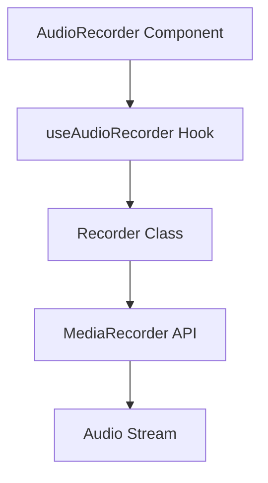
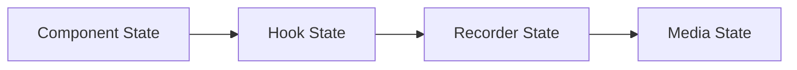
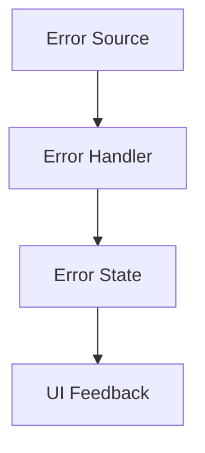
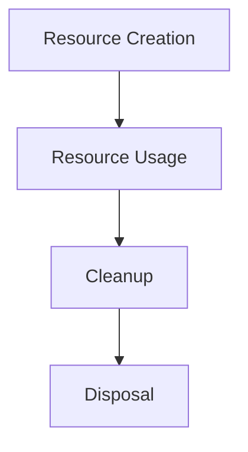

# System Patterns

_Last Updated: ${new Date().toISOString()}_

## Audio Recording System (2023-07-10)

### Architecture

The audio recording system follows a layered architecture:

1. **UI Layer**: `AudioRecorder` component in React
2. **Hook Layer**: `useAudioRecorder` custom hook for state management
3. **Service Layer**: `recorder.ts` for MediaRecorder API interactions
4. **API Layer**: Server-side routes for file storage and retrieval

### Data Flow

```
UI (AudioRecorder Component)
  ↓ ↑
Hook (useAudioRecorder)
  ↓ ↑
Service (recorder.ts)
  ↓ ↑
Browser MediaRecorder API
  ↓
API Routes
  ↓
Server File Storage
```

### Key Patterns

1. **Custom Hook Pattern**: Separates state management from UI rendering
2. **Service Layer Pattern**: Isolates browser API interactions
3. **API Route Pattern**: Provides RESTful endpoints for file operations
4. **Error Boundary Pattern**: Handles and displays errors gracefully

### Testing Strategy

1. **Component Tests**: Verify UI rendering and user interactions
2. **Hook Tests**: Ensure state management works correctly
3. **API Tests**: Validate server-side functionality
4. **Mock Pattern**: Simulate browser APIs and file operations

### Component Architecture



### State Management Pattern



### Error Handling Pattern



### Resource Management Pattern



## Design Patterns

### Component Patterns

1. Controlled Components:

   - Props-driven behavior
   - Clear state management
   - Predictable updates

2. Custom Hooks:

   - Reusable logic
   - Encapsulated state
   - Clean interfaces

3. Error Boundaries:
   - Graceful error handling
   - User feedback
   - Recovery options

### State Management Patterns

1. State Initialization:

   ```typescript
   const [state, setState] = useState(() => ({
     initialValue: computeInitialValue(),
   }));
   ```

2. Effect Cleanup:

   ```typescript
   useEffect(() => {
     // Setup
     return () => {
       // Cleanup
     };
   }, [dependencies]);
   ```

3. Ref Management:
   ```typescript
   const ref = useRef(null);
   useEffect(() => {
     if (ref.current) {
       // Safe access
     }
   }, []);
   ```

### Mobile-First Patterns

1. Responsive Design:

   - Fluid layouts
   - Breakpoint management
   - Touch-friendly controls

2. Performance:

   - Resource optimization
   - Efficient updates
   - Memory management

3. Accessibility:
   - ARIA attributes
   - Keyboard navigation
   - Screen reader support

## Implementation Guidelines

### Code Organization

1. Component Structure:

   ```
   /components
     /interview-prep
       AudioRecorder.tsx
   /hooks
     useAudioRecorder.ts
   /lib
     /audio
       recorder.ts
   ```

2. Type Definitions:

   ```typescript
   interface Props {
     // Component props
   }

   interface State {
     // State interface
   }

   type Handler = (event: Event) => void;
   ```

3. Error Management:
   ```typescript
   try {
     // Operation
   } catch (error) {
     // Type-safe error handling
   }
   ```

### Testing Strategy

1. Unit Tests:

   - Component rendering
   - Hook behavior
   - Error cases

2. Integration Tests:

   - Browser compatibility
   - Device testing
   - Performance metrics

3. User Testing:
   - Mobile usability
   - Error recovery
   - Feature completeness

## System Architecture

The application follows a modern Next.js architecture with the following key components:

- **Frontend**: Next.js App Router with React components
- **Backend**: Next.js API routes
- **Database**: PostgreSQL with Prisma ORM
- **Authentication**: NextAuth.js
- **Styling**: Tailwind CSS with shadcn/ui components

## Interview Prep Feature Architecture

The Interview Prep feature follows a modular architecture with clear separation of concerns:

### User Flow

The Interview Prep feature is designed with a logical user flow:

1. **Interview Prep Plan** (First Activity):

   - Users input job details or import from ApplyRight
   - System generates a personalized preparation plan
   - Users can export the plan as PDF

2. **Mock Interview**:

   - Users practice with AI-generated questions
   - System provides feedback on responses
   - Summary page shows overall performance

3. **Question Library**:
   - Users browse and filter questions
   - Save questions for later review
   - Add notes to saved questions

This flow guides users through the preparation process, emphasizing planning before practice.

### Premium Feature Testing

For testing purposes, all authenticated users are treated as premium users. This allows for comprehensive testing of premium features before implementing actual subscription checks. The `checkPremiumStatus` function in the Interview Prep Plan component is configured to return `true` for any authenticated user.

### Data Models

1. **InterviewSession**:

   - Represents a mock interview session
   - Contains metadata about the job, company, and industry
   - Tracks session status and timing
   - Links to questions and responses

2. **InterviewQuestion**:

   - Represents a question in a mock interview
   - Contains question text, type, and order
   - Links to the session and response

3. **InterviewResponse**:

   - Represents a user's response to a question
   - Contains response text, feedback, and scoring
   - Links to the question and session

4. **QuestionLibrary**:

   - Represents a question in the library
   - Contains question text, job type, industry, difficulty, and category
   - Can be saved by users

5. **UserSavedQuestion**:
   - Represents a question saved by a user
   - Contains user notes
   - Links to the user and question

### API Structure

1. **Mock Interview API**:

   - `/api/interview-prep/mock-interview` (POST, PUT):
     - POST: Start a new session
     - PUT: Submit a response
   - `/api/interview-prep/mock-interview/[sessionId]` (GET, DELETE):
     - GET: Retrieve session details
     - DELETE: End a session and generate summary
   - `/api/interview-prep/mock-interview/evaluate` (POST):
     - Evaluate a response with detailed feedback

2. **Question Library API**:

   - `/api/interview-prep/questions` (GET, POST):
     - GET: Browse questions with filters
     - POST: Save a question to personal library
   - `/api/interview-prep/questions/[id]` (GET, PUT, DELETE):
     - GET: Retrieve a saved question
     - PUT: Update notes for a saved question
     - DELETE: Remove a question from personal library

3. **Interview Prep Plan API**:
   - `/api/interview-prep/generate-plan` (POST):
     - Generate a personalized interview preparation plan
     - Create practice questions based on job details

### Component Structure

1. **Page Components**:

   - `InterviewPrepPage`: Main landing page with feature overview
   - `InterviewPrepPlan`: Plan generation page
   - `MockInterviewPage`: Mock interview session page
   - `InterviewSummaryPage`: Session summary page
   - `QuestionsPage`: Question library browsing page
   - `QuestionDetailPage`: Individual question page

2. **Shared Components**:

   - `JobDetailsForm`: Form for collecting job details
   - `InterviewPrepPDF`: PDF rendering component
   - `PDFRenderer`: PDF download component
   - `FeedbackLayout`: Layout with feedback button

3. **Utility Components**:
   - `crypto-polyfill.js`: Polyfills for PDF generation
   - `pdf-utils.js`: Utilities for PDF generation and download

## Key Design Patterns

### State Management

- **Client-side State**: React useState and useEffect hooks for component-level state
- **Server State**: API routes with Prisma for database interactions
- **Persistence**: localStorage for session persistence between page refreshes

### Component Patterns

- **Layout Components**: FeedbackLayout for consistent page structure
- **Card-based UI**: Card components for displaying questions, feedback, and statistics
- **Responsive Design**: Mobile-first approach with responsive grid layouts

### API Patterns

- **RESTful API**: Standard HTTP methods (GET, POST, PUT, DELETE) for resource operations
- **Request Validation**: Zod schema validation for API request bodies
- **Error Handling**: Consistent error response format with appropriate status codes
- **Authentication Check**: Server-side session validation for protected routes

## Other Key Technical Patterns

- **Form Handling**: Controlled components with React state
- **Loading States**: Visual indicators for asynchronous operations
- **Error Handling**: Try-catch blocks with toast notifications for user feedback
- **Pagination**: Offset-based pagination for large data sets
- **Filtering**: Query parameter-based filtering for data retrieval

## System Architecture

### Next.js App Router Architecture

The application is built using Next.js with the App Router architecture, which provides several advantages:

- Server Components for improved performance and SEO
- Built-in API routes for backend functionality
- File-based routing for simplified navigation
- Metadata API for dynamic SEO optimization
- Server-side rendering capabilities for improved initial load times

### Module System

- **CommonJS Modules**: The application uses CommonJS module format (require/module.exports) for compatibility
- **Configuration Files**: All configuration files (tailwind.config.ts, postcss.config.ts) use module.exports syntax
- **Script Files**: Utility scripts use .cjs extension to ensure they are treated as CommonJS modules
- **Module Resolution**: Next.js is configured to handle CommonJS modules correctly

### Component Structure

- **Layout Components**: Define the overall structure of pages (header, footer, etc.)
- **Page Components**: Implement specific page functionality
- **UI Components**: Reusable interface elements
- **Feature Components**: Implement specific features like ApplyRight, Interview Prep, etc.

### Data Flow

- Server Components fetch data on the server
- Client Components handle user interactions
- API routes provide backend functionality
- Database interactions are handled through Prisma

### Feedback System Architecture

- **Dual Storage Strategy**:
  - Primary: Prisma database with AppFeedback model
  - Fallback: File-based JSON storage in feedback-data.json
- **Component Structure**:
  - FeedbackLayout: Wrapper component for pages with feedback functionality
  - FeedbackButton: Trigger for feedback modal
  - FeedbackForm: Form for collecting ratings and comments
- **API Routes**:
  - /api/feedback: For submitting feedback
  - /api/admin/feedback: For retrieving feedback (admin only)
  - /api/admin/feedback/export: For exporting feedback to CSV (admin only)
- **Error Handling**:
  - Graceful degradation from database to file storage
  - Comprehensive logging for troubleshooting
  - User-friendly error messages

## Key Technical Decisions

### SEO Implementation

- **Metadata API**: Using Next.js Metadata API for dynamic metadata generation
- **JSON-LD**: Implementing structured data using JSON-LD format
- **Dynamic Sitemap**: Generating sitemap.xml dynamically based on content
- **Dynamic Robots.txt**: Configuring robots.txt dynamically

### CSS Strategy

- **Critical CSS**: Inline critical CSS for above-the-fold content
- **Non-Critical CSS**: Load non-critical CSS asynchronously
- **Tailwind CSS**: Utility-first CSS framework for consistent styling
- **CSS Variables**: Used for theming and consistent design

### JavaScript Optimization

- **Code Splitting**: Automatic code splitting by Next.js
- **Dynamic Imports**: Lazy loading components when needed
- **Script Optimization**: Using next/script for script loading strategies
- **Tree Shaking**: Removing unused code

### Image Optimization

- **next/image**: Using Next.js Image component for automatic optimization
- **Responsive Images**: Implementing srcset for different screen sizes
- **Lazy Loading**: Loading images only when they enter the viewport
- **WebP Format**: Using modern image formats when supported

## Design Patterns in Use

### Component Patterns

- **Compound Components**: For complex UI elements with multiple parts
- **Render Props**: For sharing code between components
- **Higher-Order Components**: For adding functionality to existing components
- **Custom Hooks**: For reusing stateful logic

### State Management

- **React Context**: For global state management
- **useState/useReducer**: For component-level state
- **Server State**: For data fetched from the server

### API Patterns

- **RESTful API**: For standard CRUD operations
- **API Routes**: Using Next.js API routes for backend functionality
- **Error Handling**: Consistent error handling across API calls

### Accessibility Patterns

- **Semantic HTML**: Using appropriate HTML elements
- **ARIA Attributes**: Adding ARIA attributes when needed
- **Keyboard Navigation**: Ensuring keyboard accessibility
- **Focus Management**: Proper focus handling for modals and dialogs

## Component Relationships

### Layout Structure

```
RootLayout
├── Header
│   ├── Navigation
│   └── AuthButtons
├── Main Content
│   └── Page-specific components
└── Footer
    ├── FooterLinks
    └── SocialLinks
```

### Feature Relationships

```
ApplyRight
├── FileUpload
├── JobDescription
├── ResumePreview
└── CoverLetterPreview

InterviewPrep
├── JobDetailsForm
├── InterviewPlan
├── PracticeQuestions
└── MockInterview (Premium)

Blog
├── BlogList
├── BlogPost
├── CategoryFilter
└── SearchBar
```

## Technical Constraints

- Next.js App Router architecture
- TypeScript for type safety
- Tailwind CSS for styling
- Prisma for database interactions
- NextAuth for authentication
- Vercel for deployment

### CSS Conflict Resolution

- **Custom Prefixed Classes**: Using `synthalyst-` prefix for custom classes to avoid conflicts
- **CSS Specificity Management**: Using higher specificity selectors when needed
- **Important Flag Usage**: Strategic use of `!important` for critical styling
- **Media Queries**: Implementing responsive behavior with breakpoint-specific styles
- **Development vs. Production**: Strategies for handling CSS differences between environments
  - Identifying conflicting styles in production
  - Creating override classes with higher specificity
  - Testing in both environments to ensure consistency

## Audio Recording Architecture

### Storage Abstraction Pattern

We've implemented a flexible storage abstraction for audio recordings that follows the Strategy pattern:

```typescript
// Interface defining the storage operations
export interface AudioStorage {
  saveAudio(
    audioBlob: Blob,
    filename?: string
  ): Promise<{ url: string; filename: string }>;
  getAudioUrl(filename: string): Promise<string>;
}

// Concrete implementation for local filesystem storage
class LocalAudioStorage implements AudioStorage {
  // Implementation details...
}

// Concrete implementation for AWS S3 storage
class S3AudioStorage implements AudioStorage {
  // Implementation details...
}

// Factory function to create the appropriate storage implementation
export function createAudioStorage(): AudioStorage {
  const storageType = process.env.AUDIO_STORAGE_TYPE || "local";

  switch (storageType) {
    case "s3":
      return new S3AudioStorage();
    case "local":
    default:
      return new LocalAudioStorage();
  }
}

// Export a singleton instance
export const audioStorage = createAudioStorage();
```

This pattern allows us to:

1. Switch between storage implementations without changing client code
2. Add new storage providers easily by implementing the AudioStorage interface
3. Test different storage implementations independently
4. Configure the storage type via environment variables

### API Route Design

The audio API routes follow RESTful principles:

1. **POST /api/audio** - Upload a new audio recording

   - Accepts multipart/form-data with an "audio" field
   - Validates file size and MIME type
   - Stores the file using the configured storage provider
   - Creates a database record for tracking
   - Returns the URL, filename, and ID of the recording

2. **GET /api/audio** - Retrieve an audio recording
   - Accepts either a filename or recording ID as query parameters
   - Looks up the recording in the database if ID is provided
   - Generates a URL for accessing the audio file
   - Returns the URL to the client

### Database Integration

Audio recordings are tracked in the database using the AudioRecording model:

```prisma
model AudioRecording {
  id        String   @id @default(uuid())
  filename  String
  url       String
  userId    String?
  createdAt DateTime @default(now())
  updatedAt DateTime @updatedAt

  @@index([userId])
}
```

This allows us to:

1. Associate recordings with users
2. Track metadata about recordings
3. Implement access control based on ownership
4. Query and filter recordings

### Client-Side Component Design

The AudioRecorder component follows a stateful component pattern:

1. Manages internal state for recording status, playback, and errors
2. Provides a clean API for parent components
3. Handles browser compatibility issues internally
4. Provides clear visual feedback to users

## Caching Architecture [2024-03-15]

### Cache Key Strategy

- Version-based prefixing for breaking changes
- Job details incorporated in key generation
- Base64 encoded optional parameters
- Premium user flag in key structure

### Cache Duration

- Success responses: 24 hours TTL
- Fallback content: 12 hours TTL
- Premium users: Optional cache bypass

### Cache Warming

- Pre-cached responses for common job titles
- Background execution for minimal latency
- Error handling with fallback content
- Monitoring of warm cache hits

### Cache Invalidation

- Automatic on error responses
- Version-based for breaking changes
- Premium user manual bypass
- TTL-based expiration

### Cache Response Structure

- Cache status metadata
- Generation timestamps
- Fallback content markers
- Source tracking (cache vs. generated)

### Performance Monitoring

- Cache hit/miss tracking
- Response time logging
- Error rate monitoring
- Cache size tracking

### Error Handling

- Fallback content generation
- Automatic retry mechanism
- Error logging and monitoring
- User feedback on cache status

## Tailwind CSS Configuration Patterns (March 17, 2025)

### PostCSS Integration

The application uses Tailwind CSS with PostCSS for styling. The configuration follows these patterns:

1. **PostCSS Plugin Structure**:

   ```javascript
   /** @type {import('postcss-load-config').Config} */
   const config = {
     plugins: {
       "@tailwindcss/postcss": {},
       autoprefixer: {},
     },
   };

   module.exports = config;
   ```

2. **CSS Import Pattern**:

   ```css
   /* In CSS files that use Tailwind */
   @tailwind base;
   @tailwind components;
   @tailwind utilities;
   ```

3. **Custom Utility Pattern**:
   ```css
   /* Custom utilities in @layer */
   @layer utilities {
     .custom-utility {
       /* properties */
     }
   }
   ```

### CSS Class Usage Patterns

1. **Color Variable Usage**:

   ```css
   /* Using HSL variables */
   .element {
     background-color: hsl(var(--background));
     color: hsl(var(--foreground));
   }
   ```

2. **Tailwind Class Pattern**:

   ```jsx
   // In React components
   <div className="bg-[hsl(var(--background))] text-[hsl(var(--foreground))]">
     Content
   </div>
   ```

3. **Direct Color Usage**:
   ```jsx
   // Using explicit colors with bracket notation
   <div className="bg-[#f3f4f6] text-[#000000]">Content</div>
   ```

### CSS Organization

1. **File Structure**:

   ```
   /src
     /app
       globals.css       # Global styles with Tailwind imports
       critical.css      # Critical above-the-fold styles
     /components
       /ui
         component.module.css  # Component-specific styles
   /public
     /styles
       non-critical.css  # Non-critical styles loaded asynchronously
   ```

2. **Variable Organization**:

   ```css
   :root {
     /* Color variables */
     --background: 0 0% 100%;
     --foreground: 222.2 84% 4.9%;

     /* Size variables */
     --radius: 0.5rem;
   }

   .dark {
     /* Dark mode overrides */
     --background: 222.2 84% 4.9%;
     --foreground: 210 40% 98%;
   }
   ```

### Best Practices

1. **Use `@tailwindcss/postcss` instead of direct `tailwindcss` usage**
2. **Add Tailwind imports to all CSS files that use Tailwind features**
3. **Use explicit color values with bracket notation instead of named colors**
4. **Standardize on a single PostCSS configuration file**
5. **Use CSS variables for theme colors and sizes**
6. **Apply proper font weights using the font-[weight] syntax**
7. **Use HSL color variables for theme consistency**
8. **Test CSS changes in a separate branch before merging to main**

## CSS Configuration Patterns [2025-03-17]

### Tailwind CSS v4 Setup

Starting with Tailwind CSS v4, the PostCSS plugin has been moved to a separate package (`@tailwindcss/postcss`). This change requires updating the PostCSS configuration file.

#### PostCSS Configuration

```js
/** @type {import('postcss-load-config').Config} */
const config = {
  plugins: {
    "@tailwindcss/postcss": {}, // Use the new package instead of 'tailwindcss'
    autoprefixer: {},
  },
};

module.exports = config;
```

#### Required Dependencies

```json
{
  "dependencies": {
    "tailwindcss": "^4.0.14",
    "@tailwindcss/postcss": "^4.0.14"
  }
}
```

#### Error Pattern

If you see this error during build:

```
Error: It looks like you're trying to use `tailwindcss` directly as a PostCSS plugin. The PostCSS plugin has moved to a separate package, so to continue using Tailwind CSS with PostCSS you'll need to install `@tailwindcss/postcss` and update your PostCSS configuration.
```

The solution is to:

1. Install `@tailwindcss/postcss` package
2. Update the PostCSS configuration to use the new package
3. Rebuild the application

#### Integration Pattern

```mermaid
flowchart TD
    TW[Tailwind CSS] --> TWP[@tailwindcss/postcss]
    TWP --> PC[PostCSS Config]
    PC --> CSS[CSS Processing]
    CSS --> NC[Next.js Compilation]
```

This separation of concerns allows Tailwind to better maintain the PostCSS plugin separately from the core library.
