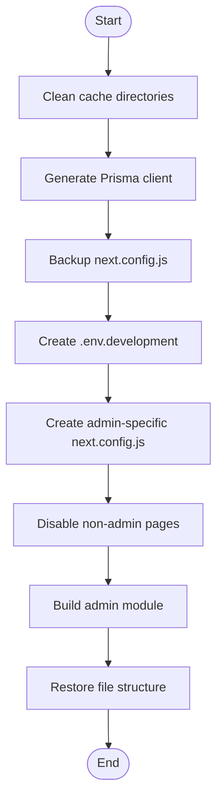

# Admin Module Build Script

## Overview

The admin module build script (`scripts/build-admin.js`) enables isolated building of the admin module, improving build performance and reliability. This document explains how the script works and how to use it.

## Usage

```bash
# Run from the project root
node scripts/build-admin.js
```

## How It Works

The script isolates and builds only the admin module by:

1. Temporarily disabling non-admin routes
2. Configuring Next.js to focus on admin-specific pages
3. Building only the admin module components
4. Restoring the original file structure after building

### Process Flow



### Key Components

1. **Cache Cleaning**

   - Removes cached data for fresh builds

2. **Dependency Verification**

   - Ensures all required dependencies are installed

3. **Configuration Management**

   - Creates temporary Next.js configuration
   - Sets environment variables for admin-focused build

4. **Page Isolation**

   - Temporarily moves non-admin pages to isolate the build

5. **Cleanup and Restoration**
   - Restores original file structure and configuration after build

## Benefits

### Performance Improvements

- **Faster Builds**: Building only admin-related code reduces build time
- **Smaller Bundles**: Only admin components are included in the build
- **Focused Optimization**: Better code splitting and optimization for admin pages

### Reliability Improvements

- **Isolated Errors**: Errors in non-admin code won't affect admin builds
- **Simplified Debugging**: Easier to debug issues in isolated modules
- **Deployment Stability**: Reduced scope leads to more stable deployments

## Technical Details

### Directories Managed

- **Temporary Storage**: `build-temp/` directory for moved files
- **Admin Code**: `src/app/(admin)/` for admin module components and routes
- **Build Output**: `.next/admin/` for admin-specific build artifacts

### Environment Configuration

- Sets `BUILD_FOCUS=admin` in `.env.development`
- Configures temporary Next.js settings in `next.config.js`

### Build Configuration Overrides

- **TypeScript**: Ignore build errors during module builds
- **ESLint**: Skip linting during module builds
- **Static Generation**: Increased timeout for complex pages

## Troubleshooting

### Common Issues

1. **Failed Dependency Generation**

   - Run `npx prisma generate` manually to verify Prisma schema

2. **File Restoration Issues**

   - If files aren't properly restored, check the `build-temp` directory

3. **Configuration Conflicts**
   - Ensure no conflicting environment variables in `.env` files

### Build Log Analysis

Build logs are timestamped for easy analysis:

```
[YYYY-MM-DD HH:MM:SS] Message
```

Key log markers:

- "Starting admin module build" - Build initialization
- "Building Next.js admin module" - Next.js build process start
- "Admin module build completed successfully" - Successful build
- "Restoring original directory structure" - Cleanup process

## Future Enhancements

1. **Automated Testing**: Add test runs after module builds
2. **Parallel Building**: Support concurrent module building
3. **Incremental Builds**: Optimize for faster incremental builds
4. **Deployment Integration**: Direct integration with CI/CD workflows
5. **Build Metrics**: Track and report build performance metrics
